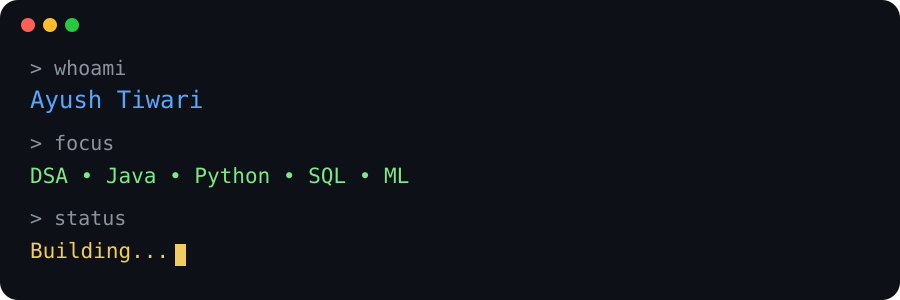

<!-- 🌧️ Animated Header -->

  

<h1 align="center">Hi, I'm Ayush Tiwari 👋</h1>

  

<h3 align="center">
  CSE (Data Science) Student | Aspiring SDE | Developer
</h3>

  Building • Learning • Solving

---

## 💻 Developer Terminal

  

---

## 💻 Languages & Technologies

  
  
  
  

  Java • C • HTML • CSS

---

## 📊 Data Science & Machine Learning

  
  
  
  
  
  

  Python • SQL • Machine Learning • Data Analysis • NumPy • Pandas • Scikit-learn • Matplotlib

---

## 🌐 Development

  
  

  React • Tailwind CSS • Frontend Development

---

## 🧠 Core Computer Science

  Data Structures • Algorithms • OOP • DBMS • Operating Systems • Computer Networks

---

## 🛠️ Tools & Platforms

  
  
  
  
  

  Git • GitHub • Jira • VS Code • Postman

---

## 🚀 Featured Projects

### 📚 EduCompanion

An educational platform designed to provide useful learning tools and an interactive student experience.

**Tech:** React • Tailwind CSS • APIs • JavaScript

---

### 🌱 SasyaNex

A smart agriculture advisory concept designed to help farmers access useful information and recommendations.

**Tech:** Web Development • APIs • Database • AI/Chatbot

---

### ⛏️ Mine Vehicle Safety System

A safety-focused project for improving vehicle operation in fog and low-visibility conditions in open-cast mines.

**Focus:** Sensors • IoT • Safety Automation

---

## 📈 GitHub Activity

  

---

## 🔥 Contribution Streak

  

---

  

<h3 align="center">
  Learning • Building • Improving
</h3>

  ⭐ Thanks for visiting my profile!

